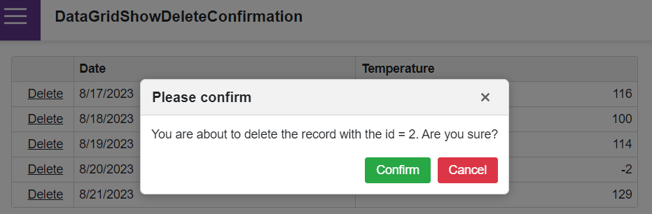

<!-- default badges list -->

<!-- default badges end -->

# Grid for Blazor - Create a custom record deletion confirmation dialog

The example uses the DevExpress Blazor Popup control ([DxPopup](https://docs.devexpress.com/Blazor/DevExpress.Blazor.DxPopup)) alongside our Blazor Grid (to create a custom confirmation dialog).

The project illustrates how you can incorporate the following capabilities into your Blazor-powered web application:

- Create a custom confirmation dialog with the **Confirm** and **Cancel** [buttons](https://docs.devexpress.com/Blazor/DevExpress.Blazor.DxButton).
- Add a custom **Delete** button to a Blazor Grid column.
- Display a confirmation dialog when a user [clicks](https://docs.devexpress.com/Blazor/DevExpress.Blazor.DxButton.Click) the **Delete** button.
- Delete the record when a user clicks the **Confirm** button.

## Files to Review

- [Index.razor](./CS/DataGridShowDeleteConfirmation/Pages/Index.razor)

## Documentation

- [Grid: Data Binding](https://docs.devexpress.com/Blazor/403737/grid/bind-to-data)
- [Grid: Edit Data and Validate Input](https://docs.devexpress.com/Blazor/403454/grid/edit-data-and-validate-input)
- [Show and Close a Popup](https://docs.devexpress.com/Blazor/DevExpress.Blazor.DxPopup#show-and-close-a-popup)

## More Examples

- [Grid for Blazor - How to edit a row on a separate page](https://supportcenter.devexpress.com/ticket/details/t802173/grid-for-blazor-how-to-edit-a-row-on-a-separate-page)
