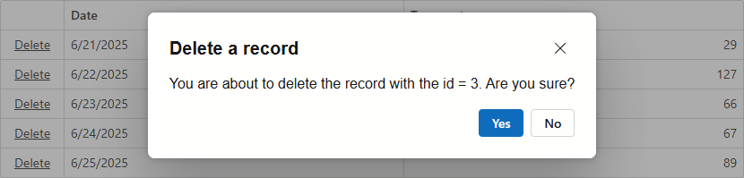

<!-- default badges list -->

[](https://supportcenter.devexpress.com/ticket/details/T802166)
[](https://docs.devexpress.com/GeneralInformation/403183)
[](#does-this-example-address-your-development-requirementsobjectives)
<!-- default badges end -->

# Grid for Blazor - Create a custom record deletion confirmation dialog

The example uses the DevExpress Blazor Popup control ([DxPopup](https://docs.devexpress.com/Blazor/DevExpress.Blazor.DxPopup)) alongside our Blazor Grid (to create a custom confirmation dialog).



The project illustrates how you can incorporate the following capabilities into your Blazor-powered web application:

- Create a custom confirmation dialog with the **Yes** and **No** [buttons](https://docs.devexpress.com/Blazor/DevExpress.Blazor.DxButton).

    ```html
    <DxPopup @bind-Visible="@ConfirmationShown" HeaderText="Delete a record" Width="auto" CloseOnOutsideClick="false">
        <BodyContentTemplate>
            <p>You are about to delete the record with the id = @id. Are you sure?</p>
            <div class="confirm-dialog-buttons">
                <DxButton Text="Yes" RenderStyle="ButtonRenderStyle.Primary" Click="@OnYesButtonClick" />
                <DxButton Text="No" RenderStyle="ButtonRenderStyle.Secondary" Click="@OnNoButtonClick" />
            </div>
        </BodyContentTemplate>
    </DxPopup>
    ```
- Add a custom **Delete** button to a Blazor Grid column.

    ```html
    <DxGridCommandColumn Width="70px" NewButtonVisible="false">
        <CellDisplayTemplate Context="myContext">
            <DxButton RenderStyle="ButtonRenderStyle.Link" RenderStyleMode="ButtonRenderStyleMode.Contained" Text="Delete" Click="@(() => OnDeleteButtonClick(myContext))" />
        </CellDisplayTemplate>
    </DxGridCommandColumn>
    ```
- Display a confirmation dialog when a user [clicks](https://docs.devexpress.com/Blazor/DevExpress.Blazor.DxButton.Click) the **Delete** button.

    ```cs
    bool ConfirmationShown { get; set; } = false;

    void OnDeleteButtonClick(GridCommandColumnCellDisplayTemplateContext context) {
        id = (context.DataItem as WeatherForecast).ID;
        ConfirmationShown = true;
    }
    ```
- Delete the record when a user clicks the **Yes** button.

    ```
    void OnYesButtonClick() {
        forecasts.Remove(forecasts.Find(m => m.ID == id));
        myGrid.Reload();
        ConfirmationShown = false;
    }
    void OnNoButtonClick() {
        ConfirmationShown = false;
    }
    ```

## Files to Review

- [Index.razor](./CS/DataGridShowDeleteConfirmation/Pages/Index.razor)

## Documentation

- [Grid: Data Binding](https://docs.devexpress.com/Blazor/403737/grid/bind-to-data)
- [Grid: Edit Data and Validate Input](https://docs.devexpress.com/Blazor/403454/grid/edit-data-and-validate-input)
- [Show and Close a Popup](https://docs.devexpress.com/Blazor/DevExpress.Blazor.DxPopup#show-and-close-a-popup)
- [Confirmation Dialog Based on DevExpress Blazor Message Box](https://docs.devexpress.com/Blazor/404497/components/dialogs-and-windows/confirmation-dialog)

## More Examples

- [Grid for Blazor - How to edit a row on a separate page](https://supportcenter.devexpress.com/ticket/details/t802173/grid-for-blazor-how-to-edit-a-row-on-a-separate-page)
<!-- feedback -->
## Does This Example Address Your Development Requirements/Objectives?

[](https://www.devexpress.com/support/examples/survey.xml?utm_source=github&utm_campaign=blazor-dxgrid-show-custom-confirmation-dialog&~~~was_helpful=yes) [](https://www.devexpress.com/support/examples/survey.xml?utm_source=github&utm_campaign=blazor-dxgrid-show-custom-confirmation-dialog&~~~was_helpful=no)

(you will be redirected to DevExpress.com to submit your response)
<!-- feedback end -->
